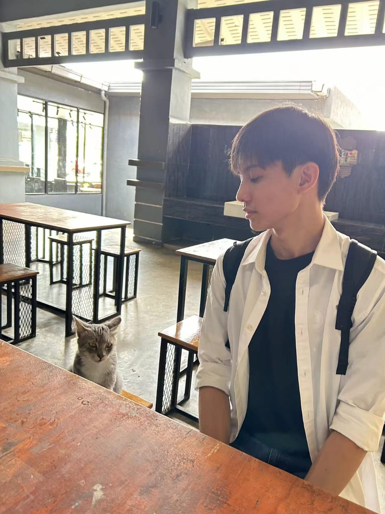
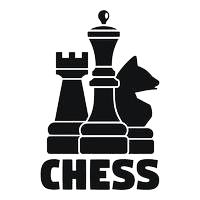

<table border="10" align="center">
  <!--Biodata-->
  <tr>
    <td colspan="2" align="center">
      
    </td>
    <td colspan="2">
     <!-- <blockquote>Nickname </blockquote>
      
<b>Jeng / David</b>

      <blockquote>Language :</blockquote>
      
<b>Malay, English, Mandarin, and Cantonese</b>

      <blockquote>About Me :</blockquote>
      
I am driven to create meaningful and efficient solutions that make a real difference in people’s lives. My goal is to constantly refine my skills in software development, ensuring that my work reduces errors and streamlines complex processes. I believe in continuous improvement and always look for ways to make systems work smarter, not harder.

        -->

🎓 *Student | Developer*  
🌟 ENFJ-T 
💻 Passionate about coding and creating innovative solutions.  
🌱 Currently studying *Master In Data Science*.  
💖 Love exploring *technology, music, and nature*.
    </td>
  </tr>

  <tr>
    <td colspan="4"><h4>1. Education (Universiti Teknologi Malaysia) 🎓</h4></td>
  </tr>
  <tr>
    <td colspan="4">
       
      <blockquote>
        <pre>Master in Data Science</pre>
      </blockquote>
      <blockquote>
        <pre>Bachelor of Computer Science (Software Engineering) with Honours</pre>
      </blockquote>
      <blockquote>
        <pre>Diploma in Computer Science (Information Technology)</pre>
      </blockquote>
       
    </td>
  </tr>
  <tr>
    <td colspan="4"><h4>2. Hard Skills 💻</h4></td>
  </tr>
  <tr>
    <td colspan="4">
      
##### Web Development : 

##### Programming Languages : 

##### Design Tools :
      
##### Other Tools :

        
    </td>
  </tr>
  <tr>
    <td colspan="4"><h4>3. University Activity Achievement 🏆</h4></td>
  </tr>
  <tr align="center">
    <td width="25%">
       
      <h5><b>Student College Committee</b></h5>
    </td>
    <td width="25%">
       
      <h5><b>Student Representative Council</b></h5>
    </td>
    <td width="25%">
       
      <h5><b>UTM National Parliament Representative</b></h5>
    </td>
    <td width="25%">
       
      <h5><b>Event Lecturer</b></h5>
    </td>
  </tr>
  <tr>
    <td colspan="4"><h4>4. Internship Experience 💼</h4></td>
  </tr>
  <tr>
    <td colspan="4">
      <ul>
        <li>
          <b>Position: Network Maintenance</b>
          <blockquote>Company: Country Garden Pacificview Sdn Bhd</blockquote>
          <blockquote>Address: Jalan Forest City 1, Pulau Satu, 81550, Gelang Patah, Johor</blockquote>
          <blockquote>Job Scope: Troubleshoot network issues for desktops, fabricate LAN cables, set up and commission CCTV, repair custom systems, set up wireless routers, and inspect and repair fiber optics for each building unit.</blockquote>
        </li>
        <li>
          <b>Position: Web Developer</b>
          <blockquote>Company: UTMSPACE Johor Bahru</blockquote>
          <blockquote>Address: Universiti Teknologi Malaysia, 81310 Johor Bahru, Johor.</blockquote>
          <blockquote>Job Scope: Create dynamic slideways, create whiteboard animation, create graphic designs, develop departmental website development, and develop interactive communication applications.</blockquote>
        </li>
      </ul>
    </td>
  </tr>
  <tr>
    <td colspan="4"><h4>5. Hobby :fire:</h4></td>
  </tr>
  <tr>
    <td colspan="4">
       
      

        <b>Video Game(Genshin Impact)</b>
        <b>Chess</b>
        <b>Badminton</b>
      

       
    </td>
  </tr>
</table>

<!--👋✨🔭🌱👯🤔💬📫😄⚡ -->
